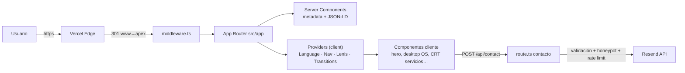

# Arquitectura — Vertical Management (somvertical.ad)

Documento de referencia técnica del sitio. Si cambias la estructura, el stack o
una decisión clave, **actualiza este archivo en el mismo PR** (ver `RULE-007` en
[AGENTS.md](./AGENTS.md)). El flujo de trabajo y las reglas de proceso viven en
[AGENTS.md](./AGENTS.md); el tablero de trabajo en [ISSUES.md](./ISSUES.md).

---

## 1. Visión general

Portfolio high-craft de **Vertical Management** (Esteban Ferrer), estética
_"Editorial Digital Disruptivo + Playful High-Craft"_.

| Capa      | Tecnología                                                                    |
| --------- | ----------------------------------------------------------------------------- |
| Framework | **Next.js 14.2** (App Router) · React 18 · TypeScript 5 (strict)              |
| Estilos   | **Tailwind CSS 3** + design tokens CSS (`src/styles/tokens.css`)              |
| Motion    | **GSAP** + `@gsap/react` · **Framer Motion 11** · **Lenis** (smooth scroll)   |
| Fuentes   | `next/font/local` — Syne (display) · Manrope (body) · JetBrains Mono (labels) |
| Email     | **Resend** (API REST directa, sin SDK)                                        |
| Hosting   | **Vercel** (apex `somvertical.ad`; `www` → 301)                               |
| Tests     | **Vitest** (unit, lógica pura) · **Playwright** (E2E)                         |

Principios rectores: las **invariantes** (`INV-01`…`INV-17`) en
[.grok/rules/invariantes.md](./.grok/rules/invariantes.md) son órdenes
permanentes de producto (no regresiones, rendimiento, CWV, motion, media
budget, a11y, i18n, privacidad, craft). Este documento describe _cómo está
hecho_ el sitio para poder cumplirlas.



---

## 2. Mapa de directorios

```
src/
├── app/                    # App Router: rutas, layouts, metadata, SEO
│   ├── api/contact/route.ts    # POST contacto (Node runtime)
│   ├── layout.tsx              # <html>, fuentes, Providers, chrome
│   ├── template.tsx            # re-mount por navegación (page enter)
│   ├── page.tsx                # Home
│   ├── nosotros/ servicios/ proyectos/ contacto/   # páginas principales
│   ├── privacidad/ aviso-legal/ cookies/           # legales
│   ├── design-system/          # spec visual (noindex)
│   ├── propuestas-hero/        # laboratorio interno de heroes (noindex)
│   ├── sitemap.ts robots.ts manifest.ts            # SEO files generados
│   ├── opengraph-image.tsx twitter-image.tsx       # OG dinámico
│   └── error.tsx not-found.tsx loading.tsx         # estados
├── components/
│   ├── layout/             # Header, Footer, MobileMenu, SkipLink, ScrollProgress…
│   ├── ui/                 # primitivas del design system (Button, Heading, Reveal…)
│   ├── home/ servicios/ proyectos/ contacto/ nosotros/ legal/  # por dominio
│   ├── transitions/        # InitialLoader, PageTransitionOverlay, RouteProgress
│   ├── providers/          # Language, Navigation, composición en Providers.tsx
│   └── seo/                # JsonLd
├── data/                   # contenido estático tipado (projects, services, carousel)
├── hooks/                  # useLenis, useMediaBudget, useMediaQuery, usePrefersReducedMotion…
├── lib/
│   ├── i18n/               # locales es/ca/en/fr, dictionaries, localized.ts
│   ├── constants.ts        # SITE, NAV_LINKS, SOCIAL_LINKS
│   ├── contact.ts          # validación + plantilla email (puro, testeable)
│   ├── seo.ts routes.ts media.ts fonts.ts gsap.ts lenis.ts motion.ts utils.ts
├── styles/                 # globals.css + tokens.css (design tokens)
├── types/                  # tipos compartidos (Project, Service…)
└── middleware.ts           # canonical host www → apex
```

Fuera de `src/`: `public/assets/` (marca + portfolio, cache immutable),
`scripts/` (utilidades de asset: optimizar imágenes, GIF→MP4, favicon),
`.grok/` (reglas/skills/hooks del agente), `viewer/` y `recursos/`
(gitignored, no trabajar ahí salvo petición explícita).

---

## 3. Estrategia de rendering

- **Server Components por defecto.** Cada página (`page.tsx`) es un Server
  Component que genera `metadata` (título, descripción, OG, canonical) vía
  helpers de `src/lib/seo.ts` y emite JSON-LD (`src/components/seo/JsonLd.tsx`).
- **Islas cliente** (`"use client"`) solo donde hay interactividad: hero
  cinemático, menú móvil, carruseles, formulario de contacto, desktop OS de
  proyectos (`dynamic(() => import(...), { ssr: false })` — code-split para no
  cargar el OS en SSR/first paint), transiciones y Lenis.
- **`template.tsx`** fuerza re-mount en cada navegación → las animaciones de
  entrada (`PageEnter`) se reproducen en cada cambio de ruta.
- **Estados globales**: `error.tsx`, `not-found.tsx`, `loading.tsx` en la raíz
  del App Router.

### Providers (composición en `src/components/providers/Providers.tsx`)

```
LanguageProvider        → locale activo (client-side, localStorage "vertical-locale")
  └─ NavigationProvider → ruta activa, historial para transiciones
       └─ LenisBridge   → smooth scroll (useLenis) con soporte reduced-motion
            └─ TransitionProvider → InitialLoader · PageTransitionOverlay · RouteProgress
```

Todo el bloque es cliente; el contenido de página se renderiza dentro y hereda
el contexto. Las transiciones y Lenis se desactivan con
`prefers-reduced-motion` (`INV-12`).

---

## 4. i18n (client-side, sin rutas por locale)

- Locales: `es` (default) · `ca` · `en` · `fr` — `src/lib/i18n/locales.ts`.
- **Un único set de rutas** (sin `/en/...`): el locale vive en estado cliente +
  `localStorage`, y sincroniza `<html lang>`.
- Diccionarios tipados: `src/lib/i18n/types.ts` define `Dictionary`; cada
  locale implementa el tipo completo (`locales/es.ts` ≈900 líneas). TypeScript
  falla si un locale pierde claves.
- `getDictionary(locale)` con fallback a `es`; `fill()` para plantillas
  `{token}`.
- El contenido estructural vive en `src/data/` (proyectos, servicios, proceso)
  y el copy por locale se fusiona con `localize*()` (`src/lib/i18n/localized.ts`).
  Añadir un proyecto = añadir a `src/data/projects.ts` + copys en los 4 locales.

---

## 5. Design system y estilos

- **Tokens**: variables CSS en `src/styles/tokens.css` (paleta paper/ink/lime,
  espaciados, tipografía) mapeadas 1:1 en `tailwind.config.ts` (colores,
  `fontFamily`, `font-size` custom como `display-2xl`…).
- `cn()` (`src/lib/utils.ts`) = `clsx` + `tailwind-merge` extendido para que los
  tamaños custom no colisionen con colores `text-*`.
- Primitivas en `src/components/ui/`: Button, Heading, Eyebrow, Badge, Reveal,
  Marquee, Magnetic, Grain, Cursor, Container…
- **Estilos scoped por página**: `home-testimonials.css`,
  `servicios/servicios-crt.css`, `nosotros/nosotros-ds.css`. Regla dura
  (`INV-16`): un look exclusivo de una ruta **no puede filtrarse** al chrome
  compartido (header/footer/menú) ni reutilizarse en otras páginas.
- Fuentes self-hosted (`next/font/local`, `display: swap`); mono sin preload
  para evitar carrera de 3 fuentes en LCP.

---

## 6. Flujo de contacto (`POST /api/contact`)

`src/app/api/contact/route.ts` (runtime Node) sobre la lógica pura de
`src/lib/contact.ts` (testeada con Vitest):

1. **Rate limit** en memoria por IP (`x-forwarded-for`): 5 req/min por
   instancia, poda periódica. Best-effort en serverless; es una capa blanda.
2. **Payload guard**: rechaza `content-length` > 32 KB (413).
3. **Validación** (`validateContactPayload`): requeridos `name`/`email`/
   `message`, límites por campo, sanitización de CRLF/control chars en campos
   sensibles a headers, normalización de email. Errores 400 con detalle por
   campo.
4. **Honeypot**: campo `website` relleno ⇒ respuesta de éxito fingida, no se
   envía nada.
5. **Entrega** (`deliverEmail`): con `RESEND_API_KEY` → POST a Resend
   (`reply_to` = remitente). Sin key:
   - producción (`NODE_ENV`/`VERCEL_ENV` = production) ⇒ **500** — nunca finge
     éxito;
   - dev/preview ⇒ log en servidor (modo `logged`).
6. Errores inesperados ⇒ 500 con mensaje seguro (incluye email de fallback).

Env vars (ver `.env.example`): `RESEND_API_KEY`, `CONTACT_TO_EMAIL`,
`CONTACT_FROM_EMAIL`, `NEXT_PUBLIC_SITE_URL`. Nunca commitear `.env*`.

---

## 7. SEO y dominio

- Metadata por ruta (title/description/canonical/OG/Twitter) desde `lib/seo.ts`
  - constantes `SITE` (`lib/constants.ts`).
- `sitemap.ts`, `robots.ts`, `manifest.ts` generados por el App Router.
- OG image dinámica (`opengraph-image.tsx`, 1200×630); proyectos usan cover.
- JSON-LD: Organization, WebSite, Person, ContactPage, CreativeWork,
  Breadcrumbs.
- **Canonical host**: `www.somvertical.ad` → `https://somvertical.ad` 301
  implementado en tres capas coherentes: `next.config.mjs` (redirects),
  `src/middleware.ts` (para builds locales/standalone) y `vercel.json` (edge).
  Solo redirige `www`; apex y previews pasan.
- Headers de seguridad + cache (`/assets/*` immutable 1 año) en
  `next.config.mjs`.
- `/design-system` y `/propuestas-hero` noindex (internos).

---

## 8. Performance, media y a11y

- **Media budget** (`hooks/useMediaBudget.ts`): concurrencia de `<video>`/loops
  limitada (menos en móvil), posters primero, pause fuera de viewport,
  `staticOnly` cuando procede (`INV-11`). Los loops FEP se sirven como MP4
  H.264 (no GIF).
- **Imágenes**: `next/image` con AVIF/WebP, `deviceSizes` acotados
  (máx. 1920) para no mandar fuentes 2K+ a móviles, cache 30 días mínimo.
- **Code-split**: desktop OS de proyectos con `ssr: false`;
  `optimizePackageImports` para GSAP (`framer-motion` excluido a propósito —
  ver comentario en `next.config.mjs`, bug de vendor-chunks en Windows).
- **Reduced motion**: `usePrefersReducedMotion` + flags en GSAP/Framer/Lenis;
  transiciones e intro se degradan (`INV-12`).
- **A11y**: skip link → `#main-content`, landmarks, menú con Escape +
  `aria-expanded` + scroll lock, focus visible, forced-colors, cursor nativo
  (`INV-17` — no cursor custom).

---

## 9. Calidad y tests

Comandos (ver también `AGENTS.md` → `RULE-005`):

| Comando                           | Qué hace                                   |
| --------------------------------- | ------------------------------------------ |
| `npm run lint`                    | ESLint (`next/core-web-vitals`)            |
| `npm run typecheck`               | `tsc --noEmit` (strict)                    |
| `npm run format` / `format:check` | Prettier (con plugin Tailwind)             |
| `npm run test`                    | **Vitest** — tests unitarios (lógica pura) |
| `npm run test:watch`              | Vitest en watch                            |
| `npm run test:e2e`                | **Playwright** — build + serve + specs E2E |
| `npm run build`                   | Build de producción                        |

### Unit + componentes (Vitest)

Dos proyectos en `vitest.config.mts`:

- **`unit`** (entorno `node`): tests junto al código en
  `src/**/__tests__/*.test.ts`. Cubren la lógica pura: validación y plantilla
  de email de contacto (`lib/contact.ts`), helpers de rutas (`lib/routes.ts`),
  paridad de claves de los 4 diccionarios i18n + `fill()` + `localize*()`,
  `cn()`, helpers de media.
- **`components`** (entorno `jsdom`): specs `src/**/*.dom.test.tsx` con Testing
  Library (`vitest.setup.ts` aporta stub de `matchMedia` para framer-motion y
  cleanup; `@vitejs/plugin-react` transforma el JSX porque el tsconfig de Next
  usa `jsx: "preserve"`). Cubren `ContactForm` (validación cliente, honeypot,
  happy path), `LanguageSwitcher` (persistencia, `<html lang>`, Escape) y
  `MobileMenu` (diálogo a11y, Escape, scroll lock).
- Regla (`RULE-006`): lógica nueva en `lib/`/`data/` ⇒ unit; componente con
  interacción ⇒ test jsdom.

### E2E (Playwright)

- `playwright.config.ts` arranca el **build de producción**
  (`npm run build && npm run start`, puerto 3000) — los specs corren contra lo
  que se despliega, no contra dev.
- Specs en `e2e/`: render de home, navegación entre rutas principales,
  formulario de contacto (validación 400 real contra la API + happy path con
  red mockeada), SEO files (`sitemap.xml`, `robots.txt`, `manifest`), 404,
  smoke con `prefers-reduced-motion`, **a11y con axe** (falla con violaciones
  critical; serious listadas para triaje) y **regresión visual opt-in**
  (`PLAYWRIGHT_VISUAL=1`; baselines dependientes de plataforma, vídeos
  congelados para determinismo).
- `test-results/`, `playwright-report/`, baselines y `lighthouse-report/`
  están gitignored.

### CI (GitHub Actions)

`.github/workflows/ci.yml`: en cada PR y push a `main` ejecuta
format:check → lint → typecheck → unit (job _quality_) y build → E2E +
reportes como artefactos (job _e2e_), más un job _lighthouse_ no bloqueante
como baseline CWV (`TASK-0015` lo hará bloqueante). Dependabot actualiza npm
y actions semanalmente. `deploy.yml` mantiene el build-check existente; el
deploy real lo hace Vercel.

### Hooks locales

Pre-commit: lint-staged (ESLint --fix + Prettier sobre staged, con
`--max-arg-length` para respetar el límite de línea de comando de Windows).
Pre-push: typecheck + suite Vitest completa.

---

## 10. Deploy

- **Vercel** conectado al repo (push a `main` ⇒ deploy producción; PRs ⇒
  preview). Guía operativa: [DEPLOYMENT.md](./DEPLOYMENT.md).
- `npm run deploy:preview` / `deploy:prod` (CLI) solo con orden explícita del
  usuario (`RULE-012`).
- Producción exige `RESEND_API_KEY` configurada o el formulario falla con 500
  (por diseño, `§6`).

---

## 11. Decisiones clave (ADR-lite)

| #   | Decisión                                               | Por qué                                                                                                                      |
| --- | ------------------------------------------------------ | ---------------------------------------------------------------------------------------------------------------------------- |
| 1   | i18n **client-side** (sin rutas por locale)            | Un solo set de rutas y transiciones; el locale es preferencia, no SEO por idioma. Riesgo asumido: HTML inicial siempre `es`. |
| 2   | Contenido en `src/data/` tipado, sin CMS               | Portfolio pequeño y estable; TypeScript valida la forma; los copys viven en diccionarios i18n.                               |
| 3   | Rate limit en memoria                                  | Serverless multi-instancia lo hace soft; suficiente como primera barrera junto a honeypot + límites de payload.              |
| 4   | Producción sin `RESEND_API_KEY` ⇒ 500                  | Nunca fingir éxito en un envío real (silencio = leads perdidos).                                                             |
| 5   | Desktop OS con `ssr: false`                            | Aísla el peso de la experiencia "Vertical OS" fuera del primer render.                                                       |
| 6   | `framer-motion` fuera de `optimizePackageImports`      | Bug conocido de vendor-chunks en Next 14 + Windows (documentado en `next.config.mjs`).                                       |
| 7   | `cpus: 1` en builds                                    | Estabiliza builds Windows (race de chunks perdidos).                                                                         |
| 8   | Canonical www→apex en 3 capas                          | Edge (Vercel), Next redirects y middleware cubren todos los entornos sin loops.                                              |
| 9   | Tests: Vitest node (sin jsdom) + Playwright prod-build | Rápido y estable en Windows; el E2E cubre la integración real de UI contra el build desplegable.                             |

---

## 12. Cómo extender

- **Página nueva**: carpeta en `src/app/` con `page.tsx` + metadata (usar
  helpers de `lib/seo.ts`), añadir a `ROUTE_LABELS` (`lib/routes.ts`) y a
  `sitemap.ts` si es indexable. Si añade flujo ⇒ spec E2E (`RULE-006`).
- **Componente**: en `components/<dominio>/`; primitivas reutilizables en
  `components/ui/`; estilos con `cn()` y tokens, sin hardcodear colores.
- **Copy nuevo**: claves en los 4 locales (`lib/i18n/locales/*.ts`) — el
  typecheck + el test de paridad fallan si falta un idioma.
- **Proyecto nuevo**: `data/projects.ts` + copys `projectItems.<slug>` en los 4
  locales + assets en `public/assets/`.
- **Cambio estructural**: actualizar este archivo y `ISSUES.md` (reglas
  `RULE-003`, `RULE-007`).
